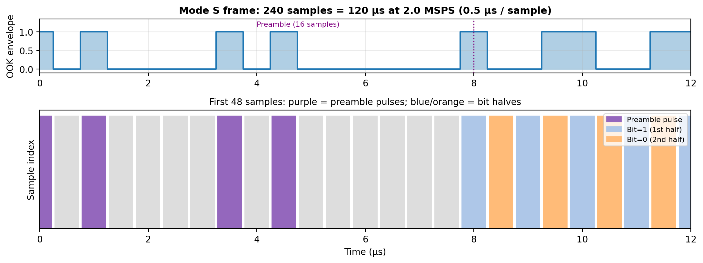
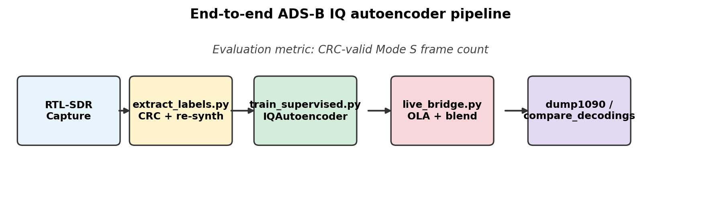
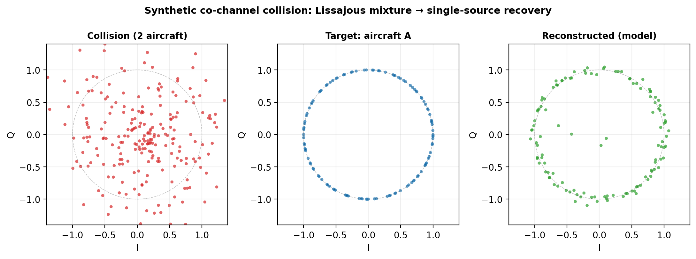
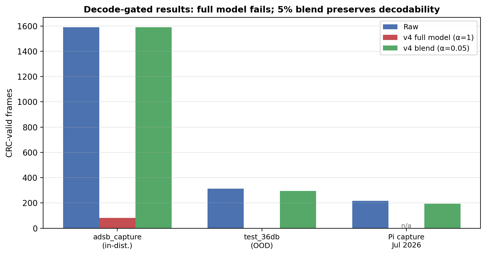
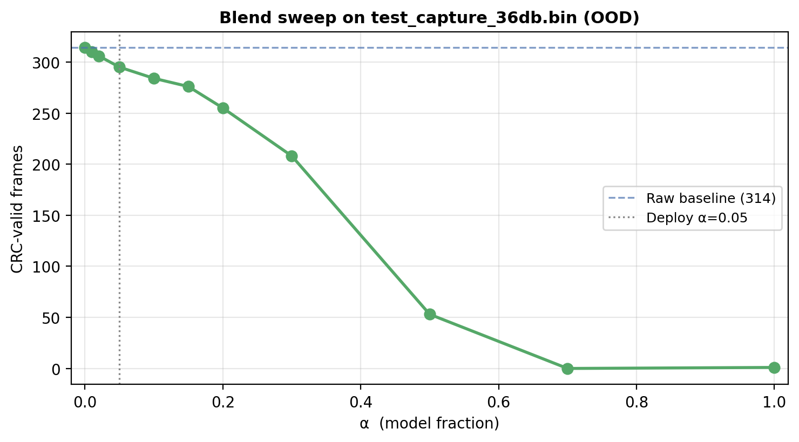

# Phase-Aware IQ Autoencoding for ADS-B Mode S: Synthetic Blind Source Separation, Real-World Constraints, and Conservative Deployment via Model–Raw Blending

**Anuvind Saj**

**Technical Report — July 2026**

> **Status:** Experimental phase closed (July 2026). Code-verified results from the `adsb_autoencoder` project.

---

## Abstract

Automatic Dependent Surveillance–Broadcast (ADS-B) Mode S receivers typically decode pulse-position-modulated messages from a magnitude-only envelope, discarding phase information that could resolve co-channel collisions. I present a phase-aware 1D U-Net autoencoder operating directly on complex baseband IQ samples at 2 MSPS, trained for denoising and blind source separation (BSS) of overlapping aircraft transmissions. Synthetic pre-training demonstrates rapid convergence and visually convincing collision separation in simulation. Supervised fine-tuning on 152,343 pairs extracted from 406 GB of RTL-SDR captures yields partial success: the v1 checkpoint recovers 116 CRC-valid frames (7.3%) from a held-out in-distribution capture versus zero from synthetic-only weights, while suppressing the estimated noise floor below raw hardware levels. Subsequent training iterations (v2–v4) achieve lower validation loss but regress on the downstream metric that matters—CRC-valid frame count—due to objective mismatch, collision-augmentation over-suppression, and out-of-distribution capture statistics. Pipeline validation (`--identity` mode) preserves 314/314 decodable frames on an out-of-distribution test capture, isolating failures to learned weights rather than streaming infrastructure. A conservative deployment strategy mixing 5% model output with 95% raw signal preserves 89–100% of raw decodability across three independent real captures. I conclude that IQ autoencoding for ADS-B is feasible in simulation but requires decoder-aligned training objectives, real collision ground truth, and domain coverage before standalone full-strength deployment is viable.

**Keywords:** ADS-B, Mode S, software-defined radio, blind source separation, U-Net, IQ processing, RTL-SDR

---

## 1. Introduction

ADS-B Mode S transponders broadcast aircraft identity, position, and velocity on 1090 MHz using on-off keying with pulse-position modulation (PPM). Ground receivers such as `dump1090` demodulate these messages by thresholding a magnitude envelope derived from IQ samples. For isolated transmissions this approach is adequate. In congested airspace, however, multiple aircraft may transmit on the same frequency within the same 120 µs frame window—a **co-channel collision**. Because the magnitude of a sum of phasors is not the sum of magnitudes, constructive and destructive phase interference corrupts PPM bit positions and causes CRC failures. Reported collision rates range from 5–15% in general traffic and can exceed 30% near major airports.

Retaining both in-phase (I) and quadrature (Q) channels through processing preserves geometric structure invisible to magnitude-only decoders: each aircraft's phasor traces a spiral on the complex plane at an angular velocity determined by its unique oscillator offset relative to the receiver's local oscillator. When two signals superimpose, their distinct rotation rates produce a **beating envelope**—a Lissajous trajectory that encodes the presence of two sources and provides a discriminant for blind source separation.

This work investigates whether a deep neural network can exploit that phase geometry to (1) denoise RTL-SDR captures while preserving sub-microsecond pulse timing, and (2) reconstruct a primary aircraft's transmission from a two-source collision—all without modifying legacy decoders. Processed IQ is written back to standard RTL-SDR `uint8` interleaved format and fed to unmodified `dump1090`, making downstream decode success the primary evaluation metric.

### 1.1 Contributions

1. A **physics-aligned data generator** (`generator.py`) synthesising 240-sample Mode S frames at 2.0 MSPS with exact PPM grid alignment, hardware impairments, and collision superposition.
2. A **phase-aware 1D U-Net** (`IQAutoencoder`, 4.19M parameters) with a composite IQ/magnitude/circular-phase loss designed for OOK carrier structure.
3. A **supervised labelling pipeline** (`extract_labels.py`) extracting 152,343 training pairs from real RTL-SDR bursts by CRC-gated re-synthesis.
4. **Hybrid collision augmentation** (`supervised_dataset.py`) superimposing synthetic interferers onto real captures, with documented failure modes when misconfigured.
5. A **streaming inference bridge** (`live_bridge.py`) with overlap-add synthesis, global DC warmup, and validated `--identity` / `--blend` modes.
6. An **honest negative-result analysis** documenting validation-loss versus decode-metric divergence, domain shift, and the partial deployability of a 5% model blend.

### 1.2 What This Paper Does Not Claim

This work does **not** claim that full-strength model inference improves ADS-B frame recovery over raw reception on real captures. It does **not** demonstrate live collision resolution on field data. It does **not** present a production-ready standalone denoiser. Success is defined as preserving decodability under conservative blending while documenting why full-strength deployment fails.

---

## 2. Background

### 2.1 Mode S PPM and Decoder Failure at Collisions

A Mode S long squitter occupies 120 µs: an 8 µs preamble (four 0.5 µs pulses) followed by 112 data bits, each encoded as a pulse in the first or second half of a 1 µs bit cell. Decoders locate preambles, slice bit windows, and validate a 24-bit CRC.

When two signals \(s_A(t)\) and \(s_B(t)\) overlap, the received sample is their complex sum \(r(t) = s_A(t) + s_B(t)\). The magnitude envelope \(|r(t)|\) depends on the instantaneous phase difference \(\Delta\phi(t)\):

- **Constructive** (\(\Delta\phi \approx 0\)): pulses appear amplified.
- **Destructive** (\(\Delta\phi \approx \pi\)): pulses may vanish entirely.

Standard threshold detectors see garbled pulse positions; CRC checks fail. This is an information-theoretic limitation of magnitude-only processing, not merely a threshold tuning problem.

### 2.2 Beating as a BSS Discriminant

After downconversion, each aircraft appears at a unique frequency offset \(f_a, f_b\) relative to the receiver IF. Their phasors rotate at different rates; during overlapping pulse windows the combined trajectory oscillates at the beat frequency \(f_{beat} = |f_a - f_b|\). In IQ space, collision events produce characteristic Lissajous figures whose angular-velocity difference is the primary feature available for source separation—provided phase is preserved through the processing chain.

### 2.3 RTL-SDR Impairments

RTL2832U dongles use zero-IF architecture, introducing DC offset, thermal AWGN, phase jitter, and slow frequency drift. Real-world noise additionally includes 1/f flicker, IQ imbalance, intermodulation, and multipath fading—effects not fully captured by simple AWGN models. Our synthetic generator and labelling pipeline model DC offset, AWGN, phase jitter, and linear drift; real texture gaps remain a documented limitation (Section 7).

### 2.4 Sampling Rate: Why 2.0 MHz

ADS-B PPM uses 0.5 µs bit halves. At **2.0 MSPS**, each bit half occupies exactly one sample:

| Quantity | Value |
|---|---|
| Sample period | 0.5 µs |
| Preamble samples | 16 |
| Data bit samples | 2 |
| Frame length | 240 samples |

At 2.4 MSPS, bit boundaries fall between samples, forcing the network to learn fractional alignment implicitly. The 2.0 MHz rate makes the PPM grid and tensor grid **identical**—a deliberate design constraint, not a compromise.


*Figure 1: OOK envelope and sample-level PPM grid. Each 0.5 µs bit half maps to one sample; preamble = 16 samples.*

---

## 3. System Overview

### 3.1 Hardware and Collection

| Component | Specification |
|---|---|
| Antenna | Custom 8-segment coaxial collinear (CoCo), 1090 MHz |
| Receiver | RTL-SDR (RTL2832U) |
| Edge nodes | Raspberry Pi 3B (collection), Pi 4 (inference target) |
| Training | Apple Silicon MacBook (MPS acceleration) |
| Storage | MinIO object store on Pi 4 + 1 TB SSD |
| Sites | `rpi_east`, `rpi_west` — independent antenna orientations |

Captures are recorded at 2 MSPS as interleaved `uint8` I/Q binaries. The ML collector (`ml_data_collector.py`) records 30-second bursts with gain rotation across {28, 32, 36, 40, 44} dB, uploading to a dedicated MinIO bucket. **406 GB** was collected across June 2026 sessions before an OOM halt; **152,343** supervised pairs were extracted from 785 label files covering **2,016** unique ICAO addresses.

### 3.2 End-to-End Pipeline

```
RTL-SDR capture (.bin / .npy)
    → extract_labels.py  →  supervised pairs (.npz)
    → train_supervised.py  →  checkpoint (.pt)
    → live_bridge.py  →  processed .bin
    → compare_decodings.py / dump1090  →  CRC-valid frame count
```

The evaluation metric throughout this report is **CRC-valid Mode S frame count** and **unique aircraft (ICAO) count**—not training loss, noise floor estimates, or preamble candidate counts alone.


*Figure 2: RTL-SDR capture through training, streaming inference, and CRC-gated evaluation.*

---

## 4. Method

### 4.1 Synthetic Data Generation

`ADSBSignalGenerator` constructs frames from first principles:

1. **PPM envelope** — preamble pulses at sample indices {0, 2, 7, 9}; data bits encoded as pulses in the first or second sample of each 2-sample bit cell.
2. **Phase accumulator** — continuous phase \(\phi(n) = 2\pi f_{offset} n T_s + \phi_0\) over all 240 samples, including silence gaps (phase continuity contract).
3. **IQ synthesis** — \(\text{IQ}(n) = A \cdot e^{j\phi(n)} \cdot \text{envelope}(n)\).
4. **Impairments** — applied in order: frequency drift, phase jitter, AWGN, DC offset.

**Collision synthesis** linearly superimposes two aircraft signals: `composite = clean_a + shifted_b`. Frequency offsets are drawn from ±50 kHz with minimum 8 kHz separation to ensure at least one beat cycle within 240 samples. Training batches use 25% collision / 75% single-aircraft examples during synthetic pre-training.

### 4.2 Supervised Labelling from Real Captures

`extract_labels.py` processes real `.npy` burst files:

1. Remove DC via full-burst mean subtraction.
2. Detect Mode S preambles with adaptive thresholding.
3. Decode bits and validate CRC.
4. Estimate amplitude, initial phase, and frequency offset from preamble pulse phases.
5. Re-s synthesise a clean target frame via `generator.py`.

Each valid pair consists of a **real noisy 240-sample window** (input) and a **mathematically ideal re-synthesised frame** (target). This is the project's central training proxy—and its central limitation: the target is not what the antenna actually received (Section 7.1).

### 4.3 Hybrid Collision Augmentation

Because CRC-passing collisions are virtually absent in real data, `SupervisedIQDataset` optionally superimposes a synthetic second aircraft onto real inputs with probability \(p\):

$$x_{aug}(n) = x_{real,A}(n) + s_{synthetic,B}(n), \quad y = \hat{s}_{clean,A}(n)$$

Interferer parameters are calibrated relative to signal A's estimated amplitude, with frequency offset constrained ≥8 kHz from A, random initial phase, random payload, and integer time offset ∈ [−24, +24] samples covering partial preamble overlaps.

**Critical design lesson (v2 regression):** A 30% augmentation rate with a **noise-free** synthetic interferer taught the model to suppress clean structured patterns—including the primary aircraft after RMS normalisation. v3 reduced the rate to 10% and added 20 dB AWGN to the interferer; v4 disabled augmentation entirely for a denoising-only retrain.

### 4.4 Network Architecture

**IQAutoencoder** — U-Net 1D convolutional autoencoder (`model.py`):

| Parameter | Value |
|---|---|
| Input shape | `(B, 2, 240)` — I and Q channels |
| Base channels | 64 |
| Depth | 4 encode/decode stages |
| Bottleneck | 2× Conv1d at `(B, 512, 15)` |
| Parameters | 4,186,242 |

Skip connections preserve sample-level pulse timing. The encoder downsamples 240 → 15; the decoder upsamples back to 240 with skip fusion. A 1×1 output head produces unbounded IQ values. U-Net was chosen over a plain autoencoder because PPM decoding requires ±0.5 µs pulse fidelity that bottleneck-only decoders blur.

### 4.5 Phase-Aware Loss Function

$$\mathcal{L}_{total} = w_{iq}\mathcal{L}_{iq} + w_{mag}\mathcal{L}_{mag} + w_{phase}\mathcal{L}_{phase}$$

- **\(\mathcal{L}_{iq}\)** — channel MSE on raw I/Q.
- **\(\mathcal{L}_{mag}\)** — MSE on magnitude envelopes, enforcing on/off pulse structure.
- **\(\mathcal{L}_{phase}\)** — circular phase error \((1 - \cos\Delta\phi)\) weighted by target magnitude (phase undefined at origin during silence).

Supervised training weights: \(w_{iq}=1.0, w_{mag}=0.5, w_{phase}=0.5\).

Naive IQ MSE alone is insufficient: zero output achieves good silence MSE but destroys pulses; phase errors penalised by IQ MSE do not correspond to PPM decode failures.

### 4.6 Training Protocol

**Phase 1 — Synthetic pre-training:**
- 8,192 train / 1,024 val synthetic samples; 25% collisions; SNR 8–25 dB.
- 50 epochs; Adam lr=1e-3; cosine annealing.
- Checkpoint: `checkpoints/best.pt`.

**Phase 2 — Supervised fine-tuning (v1):**
- 7,357 pairs from early captures; warm-start from `best.pt`.
- Encoder frozen 5 epochs; Adam lr=1e-4; 50 epochs.
- Best val loss: **3.065** (epoch 41).
- Checkpoint: `checkpoints/best_supervised.pt`.

**Phase 3 — Scaled training (v2):**
- 152,343 pairs; warm-start v1; `--collision-augment 0.30` (clean interferer).
- Best val loss: **2.208** (epoch 48).
- Checkpoint: `checkpoints/best_supervised_v2.pt`.

**Phase 4 — Corrected augmentation (v3):**
- Warm-start v1; `--collision-augment 0.10`; `--interferer-snr-db 20.0`.
- Checkpoint: `checkpoints/best_supervised_v3.pt`.

**Phase 5 — Denoising-only (v4):**
- Warm-start v1; `--collision-augment 0.0`; 25 epochs.
- Best val loss: **2.303** (epoch 25).
- Checkpoint: `checkpoints/best_supervised_v4.pt`.

---

## 5. Inference Pipeline

`live_bridge.py` implements streaming inference for deployment and offline file processing:

1. **Input:** RTL-SDR `uint8` interleaved IQ stream.
2. **DC warmup:** Global DC estimate from first ~500K samples (matches training's full-burst mean; replaces per-window DC that distorted pulses).
3. **Sliding windows:** 240 samples, hop=120 (50% overlap), Hanning synthesis window, overlap-add (OLA) reconstruction.
4. **Per-window RMS normalisation** when checkpoint metadata indicates supervised training.
5. **Model inference:** Batched forward pass (default batch_size=32).
6. **Optional blend:** `out = α × model + (1 − α) × raw` after OLA.
7. **Output:** `uint8` interleaved IQ, pipeable to `dump1090`.

**Validation modes:**
- `--identity` — full pipeline with model replaced by pass-through; validates OLA/DC/RMS.
- `--passthrough` — uint8 round-trip only; does not exercise OLA.
- `--blend ALPHA` — conservative deployment mode (Section 6.5).

Throughput on Apple Silicon MPS: ~0.27× real-time at 2 MSPS (suitable for post-capture processing; edge optimisation deferred).

---

## 6. Results

### 6.1 Synthetic Pre-Training

After 50 synthetic epochs, visual evaluation (`evaluate.py`) shows noisy Lissajous collision trajectories collapsing to clean single-source circles; magnitude beating envelopes flatten to unit amplitude. Mean per-sample IQ MSE drops 34.2% (0.356 → 0.234). Synthetic-only weights, however, produce **zero** CRC-valid frames on real captures—confirming domain shift between simulation and RTL-SDR hardware.


*Figure 3: Synthetic co-channel collision (left), clean target aircraft A (centre), model reconstruction with `best.pt` (right).*

### 6.2 Supervised Fine-Tuning (v1) — Partial Real-World Success

On `adsb_capture.bin` (480 MB, 240M samples, in-distribution benchmark):

| Condition | Noise floor | Preamble candidates | Valid frames | Aircraft |
|---|---|---|---|---|
| Raw | 0.110 | 25,371 | **1,589** | **31** |
| Synthetic only (`best.pt`) | 0.507 | 3 | 0 | 0 |
| Supervised v1 (`best_supervised.pt`) | 0.069 | 16,097 | **116** | **17** |

v1 suppresses noise below the raw hardware floor (0.069 vs 0.110) and recovers 116 frames (7.3% of raw)—establishing that domain-adapted supervised training can produce downstream-decodable output, albeit with heavy frame loss at full model strength.

### 6.3 Training Iterations v2–v4 — Validation Loss Anti-Correlates with Decode Success

| Checkpoint | Val loss | Collision aug | `adsb_capture.bin` frames | vs raw |
|---|---|---|---|---|
| v1 | 3.065 | none | **116** | 7.3% |
| v2 | 2.208 | 30% clean interferer | **8** | 0.5% |
| v3 | improved | 10% noisy interferer | 0 on OOD test* | — |
| v4 | 2.303 | 0% | **83** | 5.2% |

\* v3 evaluated on `test_capture_36db.bin`; in-distribution benchmark on `adsb_capture.bin` was not completed before experimental closure.

v2's lower loss accompanied **catastrophic decode regression** (8 vs 116 frames). Root cause: the model learned to suppress clean structured patterns from collision augmentation, then applied that behaviour to the primary aircraft at inference. v4's denoising-only retrain further reduced loss but still regressed versus v1.

### 6.4 Out-of-Distribution Failure — `test_capture_36db.bin`

A 120 MB capture (30 s, 1090 MHz centre, 36 dB gain) with **314 raw CRC-valid frames** was held out as an OOD test:

| Model | Valid frames | Notes |
|---|---|---|
| Raw input | **314** | Strong baseline |
| v1 | 0 | Works on `adsb_capture.bin`, fails here |
| v2 | 0 | Over-suppression |
| v3 | 0 | Corrected augmentation insufficient |
| v4 (α=1) | 1 | Marginal; not meaningful |

Model outputs retain hundreds of preamble candidates but fail CRC—producing plausible but subtly corrupted waveforms, not white noise. This capture differs in gain, centre frequency, and/or site statistics from the 406 GB training corpus.

### 6.5 Pipeline Validation — Infrastructure Is Not the Bottleneck

Before attributing failures to domain shift alone, the inference pipeline was validated in isolation:

| Condition | Valid frames | Aircraft |
|---|---|---|
| Raw `test_capture_36db.bin` | **314** | 9 |
| `--identity` (full OLA/DC/RMS, no model) | **314** | 9 |
| v1 model | 0 | 0 |

**Conclusion:** Overlap-add synthesis, global DC warmup, windowing, and RMS normalisation preserve all decodable frames. Zero-frame failures are attributable to **learned model weights**.

A DC warmup fix (replacing per-window DC subtraction) was applied; on this capture DC bias was ~0.1% of full scale and did not change frame counts—ruling out DC mismatch as the primary failure mode.

### 6.6 Blend Diagnostic — Deployable Partial Success

Because full-strength model output over-suppresses real ADS-B structure, I evaluated a post-hoc mix:

$$\text{out} = \alpha \cdot \text{model} + (1 - \alpha) \cdot \text{raw}$$

Offline sweeps (`blend_sweep.py`) and online streaming (`live_bridge.py --blend`) were cross-validated after fixing blend buffer edge cases.


*Figure 4: Raw vs v4 full model (α=1) vs v4 blend (α=0.05) across three captures.*


*Figure 5: Frame recovery vs α on `test_capture_36db.bin`. Sharp drop above α≈0.2; α=0.05 preserves 295/314 frames.*

**Master results table (decode-gated metric):**

| Condition | Capture | Raw frames | Processed frames | Recovery |
|---|---|---|---|---|
| Synthetic only | `adsb_capture.bin` | 1,589 | 0 | 0% |
| v1 (α=1) | `adsb_capture.bin` | 1,589 | 116 | 7.3% |
| v2 (α=1) | `adsb_capture.bin` | 1,589 | 8 | 0.5% |
| v4 (α=1) | `adsb_capture.bin` | 1,589 | 83 | 5.2% |
| **v4 blend α=0.05** | `adsb_capture.bin` | 1,589 | **1,589** | **100%** |
| v1–v4 (α=1) | `test_capture_36db.bin` | 314 | 0–1 | ~0% |
| **v4 blend α=0.05** | `test_capture_36db.bin` | 314 | **295** | **93.9%** |
| **v4 blend α=0.05** | `capture_36db_20260707` (Pi, live) | 217 | **194** | **89.4%** |

The fresh Pi capture (`capture_36db_20260707_145107.bin`, `rpi_west`, 36 dB gain, 30 s) confirms blend behaviour on newly collected data: 194/217 frames (11 aircraft in both raw and blended streams).

At α=0.05, the model contributes 5% of the output while raw preserves 95%—sufficient to retain PPM structure for CRC validation. This is the **only deployable configuration** identified in this study. It does not demonstrate denoising benefit over raw (frame counts match raw within measurement noise on two captures and slightly below on the Pi capture); it demonstrates that the learned representation is **directionally non-destructive** at low mixture weight.

---

## 7. Discussion

### 7.1 Structural Constraints

Three constraints block standalone full-strength deployment:

**No true clean RF reference.** Supervised targets are re-synthesised ideal frames from decoded bits, not antenna-ground-truth waveforms. Multipath, pulse shaping, and phase trajectory differences between target and reality create a persistent train/serve gap.

**No real collision ground truth.** CRC-passing collisions are virtually absent in labelled data. BSS capability depends on synthetic pre-training and on-the-fly augmentation—neither captures independent noise, multipath, and oscillator statistics of two real simultaneous transmitters.

**Training objective ≠ decoder metric.** IQ/magnitude/phase reconstruction loss does not enforce PPM bit-edge fidelity required for CRC. v2 proved this explicitly: best-ever val loss, worst decode regression. Lower inferred noise floor does not imply better frame recovery.

### 7.2 Two Distinct Failure Modes

| Problem | Symptom | Status |
|---|---|---|
| **A. Single-aircraft denoising** | Model destroys primary signal; 0 frames OOD | **Blocking** — blend mitigates, does not fix |
| **B. BSS / collision separation** | Cannot test on ordinary captures | **Not reached** — requires Problem A solved first |

`test_capture_36db.bin` contains 314 ordinary single-aircraft decodes, not a controlled collision scenario. The immediate blocker is signal destruction, not collision discrimination.

### 7.3 Fixed IF and Domain Shift

The deployed system tunes RTL-SDR to +250 kHz IF (`1090250000 Hz`). Encoder filters learn matched responses for specific phasor rotation rates. Captures at different centre frequencies (e.g., direct 1090 MHz) sit outside the learned angular-velocity band. Combined with gain, site, and temperature variation across the 406 GB corpus versus holdout captures, supervised fine-tuning is **not universally transferable**.

### 7.4 What Has Been Ruled Out

| Hypothesis | Evidence |
|---|---|
| OLA / windowing bug | `--identity`: 314/314 frames preserved |
| DC removal as primary cause | DC ≈ 0.001; fix unchanged frame count |
| uint8 conversion corruption | `--passthrough` and `--identity` both pass |
| Model never works on real data | v1: 116 frames on in-distribution capture |

### 7.5 Implications for ML-for-RF Practice

This project illustrates a common pitfall: optimising proxy reconstruction metrics while the deployment metric is downstream task success. Validation loss improved monotonically across v2 and v4 while decode performance regressed or stagnated. For sub-microsecond pulse systems, **decode-gated checkpoint selection** should be treated as a first-class training requirement, not a post-hoc evaluation step.

---

## 8. Deployment

### 8.1 Recommended Configuration

Use checkpoint `checkpoints/best_supervised_v4.pt` with **5% model blend**:

```bash
python live_bridge.py \
    --ckpt checkpoints/best_supervised_v4.pt \
    --blend 0.05 \
    --input data/captures/capture.bin \
    --output artifacts/clean_blend005.bin

python compare_decodings.py data/captures/capture.bin artifacts/clean_blend005.bin
```

For live streaming to `dump1090`:

```bash
rtl_sdr -f 1090000000 -s 2000000 -g 36 - \
  | python live_bridge.py --ckpt checkpoints/best_supervised_v4.pt --blend 0.05 \
  | dump1090 --ifile /dev/stdin --raw
```

**Expectation management:** At α=0.05, output ≈ raw. The model runs on the full stream but contributes minimally. Do not expect improved frame counts over raw; expect **preserved** frame counts with optional future benefit once training aligns with decode metrics.

### 8.2 Artifacts

| Artifact | Description |
|---|---|
| `checkpoints/best_supervised_v4.pt` | Recommended deployment checkpoint |
| `deploy_adsb_capture_blend.bin` | Processed in-distribution benchmark |
| `deploy_test_capture_blend005.bin` | Processed OOD benchmark |
| `blend_sweep.py` | Offline α sweep utility |
| `compare_decodings.py` | CRC frame count evaluation |

Deployment to Raspberry Pi edge nodes via `deploy.sh` (rsync to `rpi-west.local`) is supported; real-time throughput on Pi 4 CPU requires `--torchscript`, reduced overlap, or smaller model variant—not validated in this report.

---

## 9. Conclusion

I set out to build a phase-aware IQ autoencoder for ADS-B denoising and co-channel blind source separation, operating within legacy decoder constraints. The project succeeded in:

- Demonstrating **IQ-phase BSS in synthetic simulation** with rapid convergence and visually correct collision separation.
- Building a **scalable real-world labelling and training pipeline** over 406 GB of field captures.
- Achieving **partial downstream success** at full model strength on an in-distribution capture (116 frames, noise floor suppression below raw).
- Identifying and validating **infrastructure correctness** via identity-mode pipeline testing.
- Finding a **deployable conservative configuration** (5% model blend) preserving 89–100% of raw decodability across three captures.

The project did not succeed in:

- **Full-strength denoising** that matches or exceeds raw decode rates on real captures.
- **OOD generalisation** to arbitrary gain, frequency, and site conditions.
- **Real-world collision resolution** — no labelled collision data exists; synthetic augmentation alone is insufficient.
- **Aligning training loss with decode success** — lower val loss repeatedly predicted worse frames.

**Experimental phase is closed.** Further progress requires decoder-aware loss functions, decode-gated checkpoint selection, target blending during training (not just inference), and ultimately real collision captures with ground truth—not additional epochs of IQ MSE against re-synthesised targets.

---

## 10. Future Work

1. **Decode-gated training** — select checkpoints by CRC frame count on held-out captures, not val loss alone.
2. **Target blending during training** — optimise for the α=0.05 deployment mixture directly.
3. **Pulse-weighted loss** — weight reconstruction at preamble and data pulse positions.
4. **Capture metadata audit** — stratify training by gain, site, and IF; quantify OOD boundaries.
5. **Real collision data** — dual-synchronised SDR capture or high-fidelity hardware-in-the-loop simulation matching RTL-SDR noise texture.
6. **IF domain randomisation** — train across centre-frequency offsets for hardware-agnostic deployment.
7. **Edge optimisation** — TorchScript, INT8 quantisation, reduced `base_channels` for Pi real-time targets.

---

## Appendix A: Reproducibility

### A.1 Evaluation Command

```bash
python compare_decodings.py RAW.bin PROCESSED.bin
```

Reports CRC-valid frame count, unique ICAO addresses, preamble candidates, and estimated noise floor.

### A.2 Blend Sweep

```bash
python blend_sweep.py RAW.bin MODEL_OUTPUT.bin \
    --alphas 0,0.01,0.02,0.05,0.1,0.2,0.5,1.0
```

### A.3 Regenerate paper figures

```bash
cd docs && python generate_paper_figures.py
# or: cd docs && make figures
```

Outputs: `figures/fig_pipeline.png`, `fig_ppm_grid.png`, `fig_collision.png`, `fig_results_bars.png`, `fig_blend_sweep.png`.

### A.4 Key Source Files

| File | Role |
|---|---|
| `generator.py` | Synthetic frame and collision synthesis |
| `model.py` | IQAutoencoder, PhaseAwareLoss |
| `extract_labels.py` | CRC-gated supervised pair extraction |
| `supervised_dataset.py` | Dataset + collision augmentation |
| `train_supervised.py` | Supervised fine-tuning |
| `live_bridge.py` | Streaming inference, blend, identity modes |
| `compare_decodings.py` | Downstream decode evaluation |
| `blend_sweep.py` | Offline α sweep |

### A.5 Capture Provenance

| File | Duration | Notes |
|---|---|---|
| `data/captures/adsb_capture.bin` | 480 MB | In-distribution benchmark; 1,589 raw frames |
| `data/captures/test_capture_36db.bin` | 120 MB, 30 s | OOD holdout; 1090 MHz, 36 dB; 314 raw frames |
| `data/captures/capture_36db_20260707_145107.bin` | 30 s | Fresh Pi capture, rpi_west, 36 dB; 217 raw frames |

### A.6 Extended Implementation Notes

Additional engineering detail—training commands, file inventory, collector fixes, and milestone logs—is documented in `WHITEPAPER_BLUEPRINT.md` in the repository. That file is a supplementary technical appendix; this report is self-contained for methods, results, and conclusions.

---

## References

1. RTCA DO-260B — Minimum Operational Performance Standards for 1090 MHz Extended Squitter ADS-B and TIS-B.
2. P. Verlicchi et al., ADS-B collision statistics and receiver performance in dense airspace (survey literature).
3. O. Ronneberger, P. Fischer, T. Brox, "U-Net: Convolutional Networks for Biomedical Image Segmentation," MICCAI 2015.
4. M. S. Braasch, "GNSS and the Ionosphere," *Navigation*, 1996 — phase cancellation in composite signals (analogous geometry).
5. `dump1090` / FlightAware fork — reference magnitude-only ADS-B decoder used for evaluation.

---

*End of Report*
